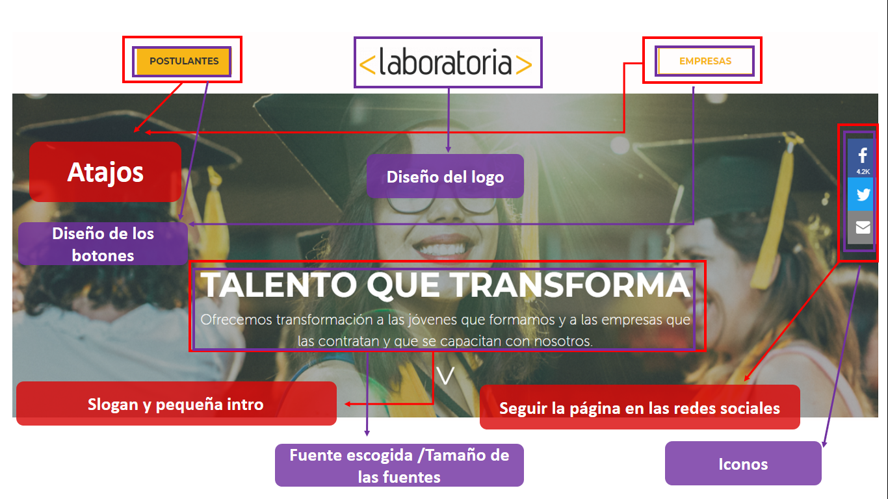
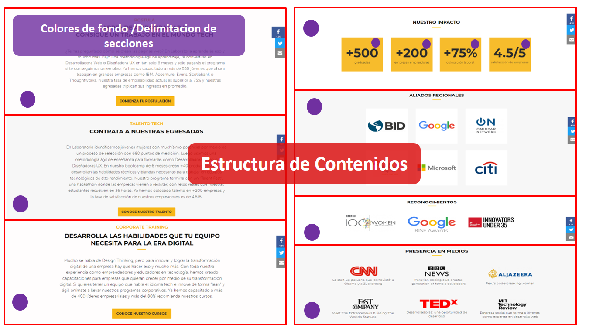
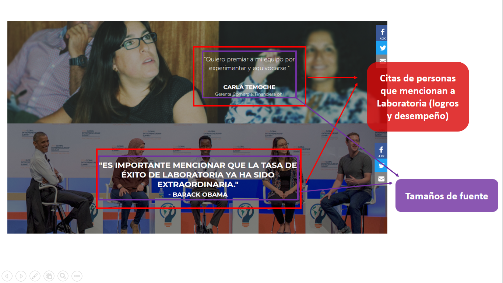
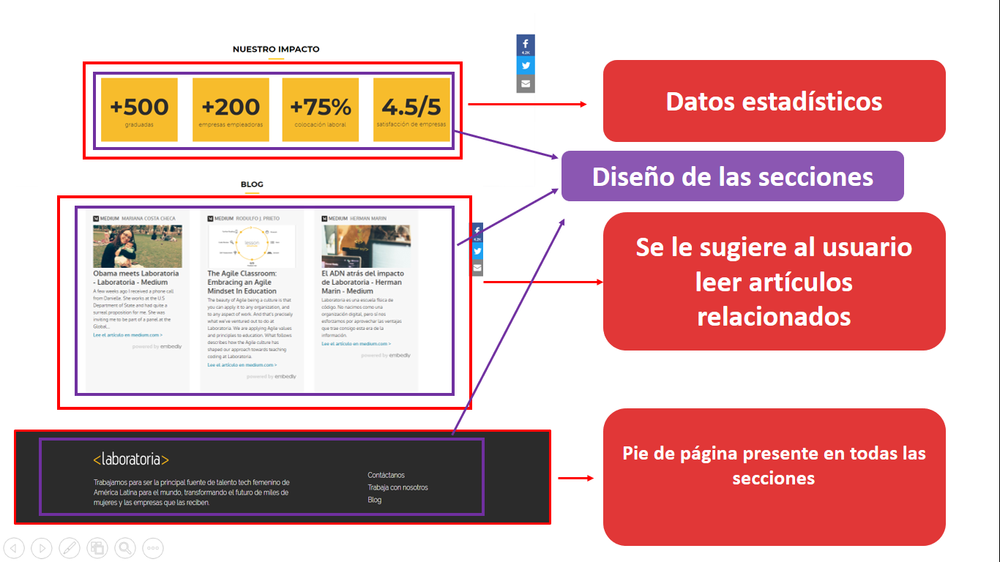
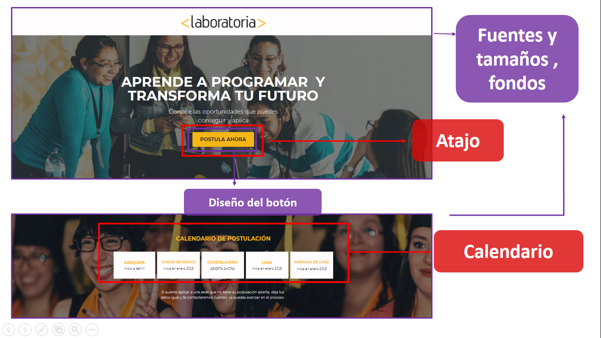
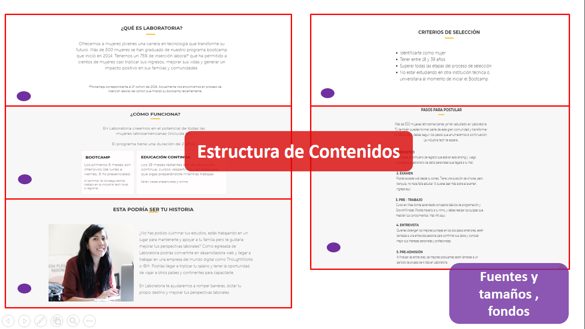
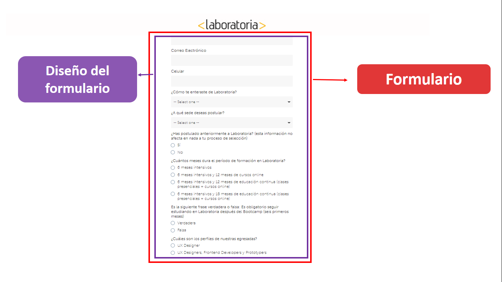
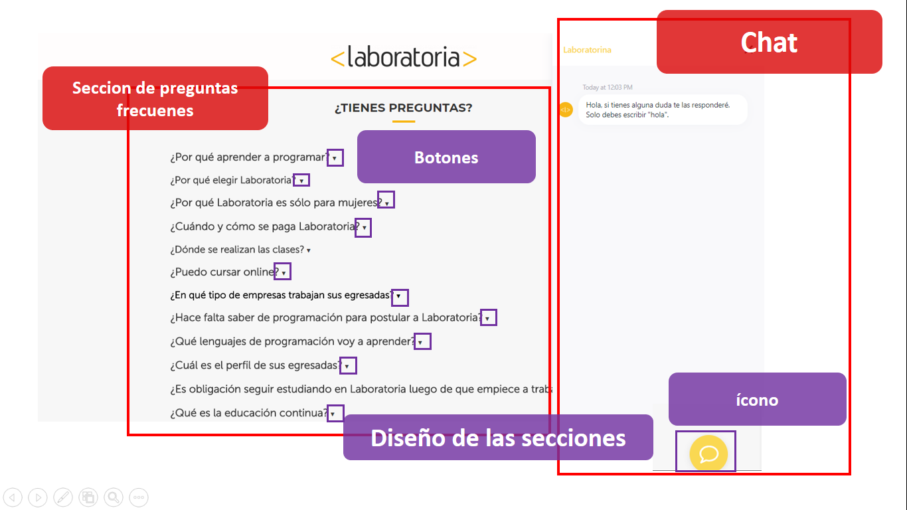
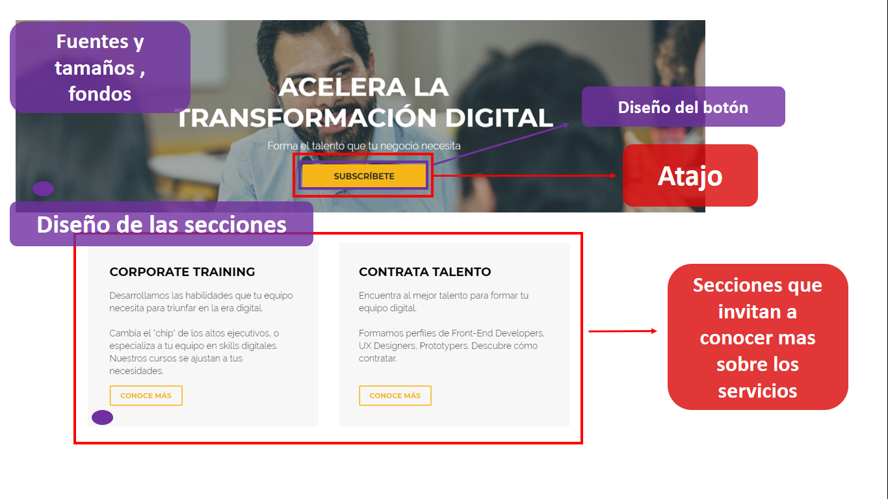
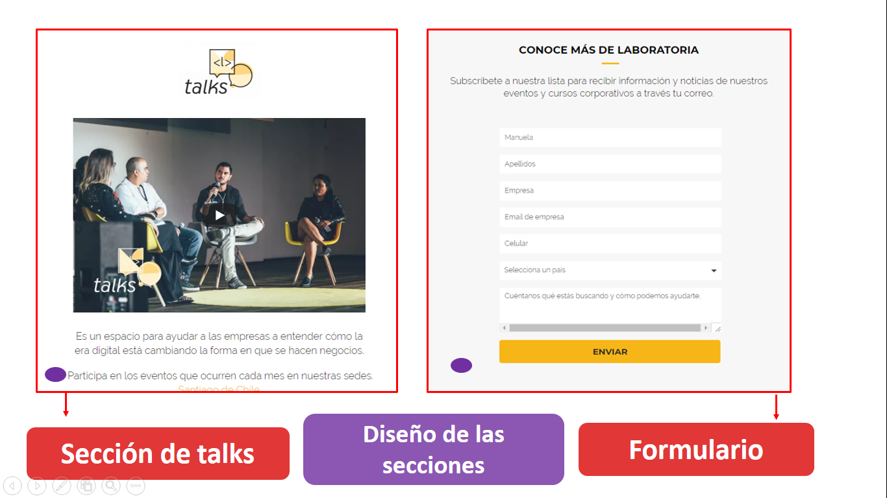

# RETO N° 1 : "Identificando las partes de UX y UI"
***
## Breve descripción :
Se debe identificar partes de UX y UI de la siguiente página :     
 *  Laboratoria (http://www.laboratoria.la/).

 ***

 ## Partes que conforman el  UX (resaltadas con lineas rojas en las imágenes) :

 ###  Página principal:

  * El formato del contenido (que empiece con un slogan “Talento que transforma” y tenga una pequeña descripción,( genera sensaciones en el usuario).
  * Opciones de atajo que diferencia a usuarios que son postulantes y usuarios que son empresas; hace que el usuario no tenga la necesidad de ver el contenido de abajo y pueda ir a una actividad especifica.
  * Las estructuras de abajo que están divididas por secciones(Postula , Talento Tech y Corporate Training, Nuestro impacto, aliados regionales , etc) que finalmente terminan invitando al usuario a ser parte de la experiencia de Laboratoria (Empresas y postulantes).
  * Las citas de las personas importantes que hablan sobre Laboratoria.
  * La estructura de los contenidos en la diferentes páginas , mostrando datos estadísticos(dan una sensación de efectividad y sinceridad).
  * Que se le sugiera al usuario leer unos artículos donde el usuario se puede informar más acerca de Laboratoria.
  * El pie de página donde se pone una pequeña descripción de lo que hace Laboratoria(haciendo que el usuario se lleve ese concepto una vez finalizada la experiencia de esa página) y las opciones :Trabaja con nosotros, Contáctanos y el blog (Está presente a lo largo de todas las páginas que conforman el sitio web)
  * Opciones de unirse a las redes sociales , presentes en todo momento.

  ### Página "Postula":
  * El chat, donde puedes dejar tus dudas(hace que el usuario sienta una asistencia permanente por parte de Laboratoria).
  * Los calendarios de postulación y atajos.
  * El formulario de postulación donde el usuario debe dejar sus datos.
  * La sección de las preguntas recurrentes (hace que el usuario pueda acceder a leer esas preguntas que muchas veces uno no se formula , pero que son importantes para terminar de entender todo el proceso) .

  ### Página "Empresas":
  * Las secciones donde se ofrecen las opciones corporate trainig y contrata talento, donde se muestra una pequeña descripción y se invita al usuario a conocer más sobre ese servicio.
  * La sección de <l> talks donde se le explica al cliente de que trata ese espacio y se le invita a explorar los contenidos (blog de Laboratoria).
  * El formulario donde la empresa deja sus datos ,  hace que la empresa reciba notificaciones y noticias de los eventos y cursos corporativos.

  ***

   ## Partes que conforman el  UI (resaltadas con lineas moradas en las imágenes) :
   * Fuente escogida .
   * Contraste de colores(estilo sobrio y no sobrecargado).
   * Colores de la marca (mostaza y negro).
   * Diseño de botones.
   * Delimitación de conceptos (jerarquización)con los tamaños de fuente.
   * Iconos utilizados.
   * Delimitación de las diferentes secciones contrastando dos colores de fondo  (gris y blanco).
   * Diseño del logo de la página.

***
  
  
  
  
  
  
  
  
  
  
